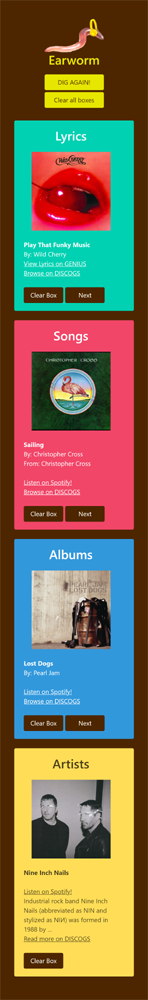
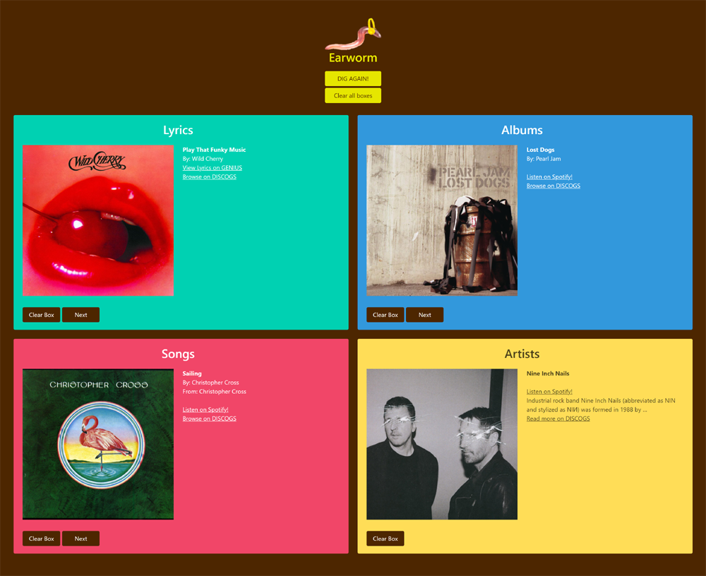

# Earworm

    ear·worm
    /ˈirˌwərm/
    noun
        1. a catchy song or tune that runs continually through a person's mind.

You have that song stuck in your head, and you can only remember a certain detail about it: A lyric, the title, the album, or the artist. There are several services that allow you to look up songs by this criteria. But earworm is an app that let's you search each of these criteria all in one place. Earworm links you to the full lyrics on Genius, allows you to go to your spotify account to listen. Plus, as there are still music lovers that want to purchase physical media (like vinyl), earworm will direct you to DISCOGS to find that item. Search didn't give you the results you were after? Click the Next button to reveal more results. When you visit Earworm again, your last search in each category is saved, just in case that song is still stuck in your head :)

# Concept
* Integrate Spotify, Discogs, and Genius to create a streamlined platform for searching songs by their lyrics or name; or albums and artist by name.
* To appease any type of music lover, the streamer, the collector, or explorer with detailed functional results

# User Story
    > AS A music lover
    > I WANT to search a music app
    > SO THAT I can find songs by lyrics, title, album or artist so that I can learn more, listen, and/or buy physical media

# Technologies used: 
    * HTML 5
    * Bulma
    * Javascript (Vanilla)
    * Genius API
    * Spotify API
    * DISCOGS API

# Roadmap
    * Collect and store user’s preferences for streaming service, physical media 
    * User preferences would determine where app links to 
    * Ability to create or add to existing playlists on preferred streaming service
    * More client side checking to find the best results that we get back from the API
    * Recommendations based on previous searches
    * What’s trending based on all Earworm searches

# Contributors

* [BrandonMinard](https://github.com/BrandonMinard)

* [fitzpatb](https://github.com/fitzpatb)

* [bahuisken](https://github.com/bahuisken)

## Deployed Application Link:

https://bahuisken.github.io/earwom/

## Screenshots

- Mobile

- Desktop

## License

No License
